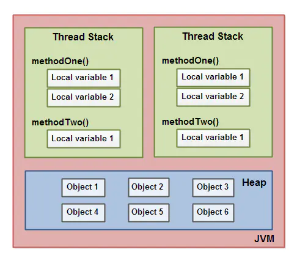
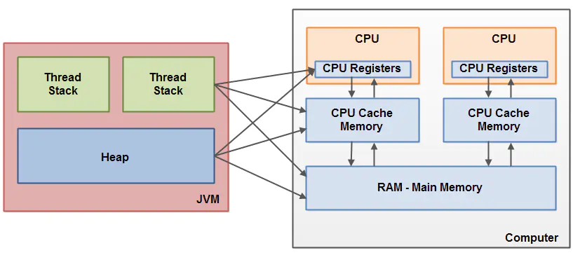

# 线程状态

- NEW 线程刚创建，还没有启动

    当前线程新建出来但没有启动，比如新建一个线程时new Thread()，此时线程就处于New状态，如果线程调用的了start()方法，此时线程开始执行run()下面的方法，这时候线程的状态也就会从New变成Runnable状态。

- RUNNABLE 可运行状态，线程调度器可以安排执行

    在Java中，Runnable状态分为两种，一种是可能没有运行，正在等待CPU调度资源分配给线程使用，另外一种是已经正在运行。假设A线程正在执行，跑到一半分配的CPU资源被调度走做了别的事情，那么此时该线程会暂时不运行，等待重新分配CPU资源，这个时候线程的状态还是RUnnable状态不会做出改变。

- BLOCKED 被阻塞，正在等待锁

  线程从RUnnable状态变成Blocked状态只有一种途径，就是当线程进入到synchronized没有拿到当前代码块对应的monitor锁，这个时候线程就会进入到Blocked状态。

- WAITING 等待被唤醒

    线程从Runnable进入Waiting有以下三种情况：
  - 线程调用了没有设置Timeout参数的Object.wait()方法。
  - 线程调用了没有设置Timeout参数的Thread.join()方法。
  - 线程调用了LockSupport.park()方法。
  - Blocked状态是针对synchronized的monitor锁的，但是java中有很多种锁，例如：ReentrantLock。在这些锁中，如果线程没有获取到锁，就会直接进去Waiting状态，其实本质就是调用了LockSupport.park()，进入到Waiting状态。

- TIMED WAITING 隔一段时间后自动唤醒

    与Waiting是一样的。 线程进入到Timed Waiting状态有以下四种情况：

  - 线程调用了设置时间参数的Thread.sleep(long millis)方法。
  - 线程调用了设置时间参数的Object.wait(long timeout)方法。
  - 线程调用了设置时间参数的Thread.join(long millis)方法。
  - 线程调用了设置时间参数的LockSupport.parkNanos(long nanos)和LockSupport.parkUntil(long deadline)方法。

- TERMINATED 线程结束

    线程进入到Terminated有两种情况：
  - run()方法中代码执行完毕，正常退出。 
  - 出现没有捕获的异常，终止的run()方法，意外退出。

```
Thread thread = new Thread();
System.out.println("thread state: " + thread.getState());
```


> 参考 https://cloud.tencent.com/developer/article/1724049?from=15425

# LockSupport.park LockSupport.unpark(&thread)

线程的挂起与唤醒

```
@Test
public void testLockSupport() throws InterruptedException {
    Thread t1 = new Thread(() -> {
        System.out.println(Thread.currentThread().getName() + " start");
        LockSupport.park(10_1000);
        System.out.println(Thread.currentThread().getName() + " end");
    });
    t1.setName("test thread1");
    t1.start();
    Thread.sleep(1_000L);
    LockSupport.unpark(t1);
    t1.join();
}
```

底层使用Futex

```
LockSupport.park
futex(0x7f765f3389d0, FUTEX_WAIT, 1618, NULL) = 0

LockSupport.unpark(&thread)
futex(0x7f765eceb0d0, FUTEX_WAKE_PRIVATE, 2147483647) = 0
```

> 原理参考 https://blog.csdn.net/weixin_43767015/article/details/107207643

# 停止线程

- stop(废弃)

  释放掉所有锁，容易产生数据不一致的问题，不建议使用

- suspend、resume(废弃)
  
  原因同上

- volatile

  打断时间点不够精确，另外线程执行了sleep、wait、ReentrantLock.lockInterruptibly()时阻塞住了无法循环回去

```
private volatile boolean done = false;

public void run() {
  while (!done) {
    //do something
  }
}
```

- interrupt(建议)

# 三大特性

- 可见性

  每个线程都有自己独立的栈空间，基本类型和对象引用的本地变量存储在线程栈中，对象的成员变量是跟随着对象本身存储在堆上的。
  多核CPU状态下，不同的线程可能会在不同的核上执行，成员变量会被放入核的L1、L2、L3 cache中，读写时只是修改缓存的副本，只有等待下次刷新缓存行时才会同步到主存，
  java层成员变量加上volatile可以保证CPU读的时候从主存获取，CPU写的时候立即同步到主存，另外java层某些操作会触发与主存的同步（例如: synchronized(this)）

  

  

  > 参考 [https://www.jianshu.com/p/a3f9f2c3ecf8](https://www.jianshu.com/p/a3f9f2c3ecf8)

- 有序性

  volatile
  CPU执行指令时存在乱序的可能，存在的条件如下:
  - as-if-serial
  - 不影响单线程的最终一致性

- 原子性

  CAS、synchronized

# 缓存行

  CPU刷缓存时时批量操作的，缓存行的单位是64k；缓存行越大，局部性空间效率越高，但读取时间慢；缓存行越小，局部空间效率越低，但读取时间快；取一个折中值，目前多用: 64字节

# 缓存一致性协议

- MESI
  
  Modified Exclusive Shared Invalid

# DCL double check lock

  单例使用

# 对象的内存布局

  8字节对齐，对象头(markword(8字节)、类型指针)，默认开启类型指针压缩和普通对象指针(oops)压缩(4字节)

  -XX:-UseCompressedClassPointer 禁止压缩类型指针
  -XX:-UseCompressedOops 禁止压缩普通对象指针

  - ## 普通对象
    - markword(锁信息、identity hashcode、gc信息)(8字节)
    - 类型指针(4字节) 指向class对象的指针
    - 实例数据 
    - 对齐数据

  - ## 数组
  - markword(锁信息、identity hashcode、gc信息)
  - 类型指针
  - 数组长度
  - 实例数据
  - 对齐数据

  对象内存查看工具
  ```
  implementation 'org.openjdk.jol:jol-core:0.16'
  
public class ClassMemorySample {
    private static class T {
        int m = 0;
        String str = "ss";
    }
    @Test
    public void test() {
        Object obj = new Object();
        System.out.println(ClassLayout.parseInstance(obj).toPrintable());
        obj.hashCode();
        synchronized (obj) {
            System.out.println(ClassLayout.parseInstance(obj).toPrintable());
        }
        System.out.println("-----------------------------------");
        Object[] array = new Object[]{new Object(), new Object()};
        System.out.println(ClassLayout.parseInstance(array).toPrintable());

        System.out.println("-----------------------------------");
        T t = new T();
        System.out.println(ClassLayout.parseInstance(t).toPrintable());
    }
}

java.lang.Object object internals:
OFF  SZ   TYPE DESCRIPTION               VALUE
  0   8        (object header: mark)     0x0000000000000001 (non-biasable; age: 0)
  8   4        (object header: class)    0xf80001e5
 12   4        (object alignment gap)    
Instance size: 16 bytes
Space losses: 0 bytes internal + 4 bytes external = 4 bytes total

java.lang.Object object internals:
OFF  SZ   TYPE DESCRIPTION               VALUE
  0   8        (object header: mark)     0x000070000a70f100 (thin lock: 0x000070000a70f100)
  8   4        (object header: class)    0xf80001e5
 12   4        (object alignment gap)    
Instance size: 16 bytes
Space losses: 0 bytes internal + 4 bytes external = 4 bytes total

-----------------------------------
[Ljava.lang.Object; object internals:
OFF  SZ               TYPE DESCRIPTION               VALUE
  0   8                    (object header: mark)     0x0000000000000001 (non-biasable; age: 0)
  8   4                    (object header: class)    0xf800234d
 12   4                    (array length)            2
 12   4                    (alignment/padding gap)   
 16   8   java.lang.Object Object;.<elements>        N/A
Instance size: 24 bytes
Space losses: 4 bytes internal + 0 bytes external = 4 bytes total

-----------------------------------
_1_threadbasic.ClassMemorySample$T object internals:
OFF  SZ               TYPE DESCRIPTION               VALUE
  0   8                    (object header: mark)     0x0000000000000001 (non-biasable; age: 0)
  8   4                    (object header: class)    0xf802ca13
 12   4                int T.m                       0
 16   4   java.lang.String T.str                     (object)
 20   4                    (object alignment gap)    
Instance size: 24 bytes
Space losses: 0 bytes internal + 4 bytes external = 4 bytes total
  ```
 
# 对象定位

- 句柄
- 直接

# 对象分配

首先尝试在栈上分配 -> 然后线程本地缓冲区(TLAB) -> eden -> s1 s2 -> 老年代

# volatile

# 锁
- 悲观锁/乐观锁
- 公平锁/非公平锁
- synchronized/CAS/JUL

ReentrantLock底层用的是AQS

# AQS