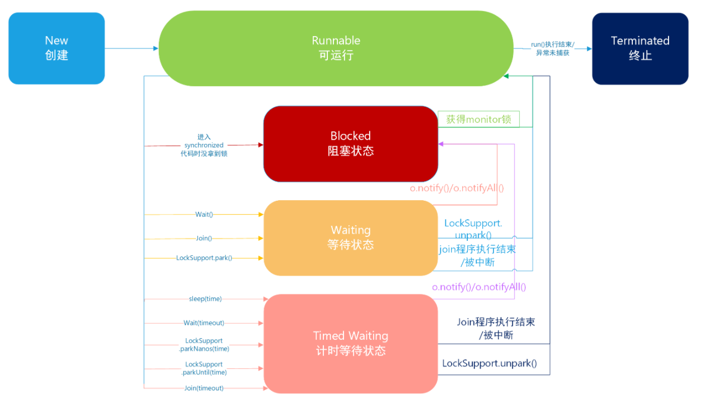

# 线程状态

- NEW 线程刚创建，还没有启动

    当前线程新建出来但没有启动，比如新建一个线程时new Thread()，此时线程就处于New状态，如果线程调用的了start()方法，此时线程开始执行run()下面的方法，这时候线程的状态也就会从New变成Runnable状态。

- RUNNABLE 可运行状态，线程调度器可以安排执行

    在Java中，Runnable状态分为两种，一种是可能没有运行，正在等待CPU调度资源分配给线程使用，另外一种是已经正在运行。假设A线程正在执行，跑到一半分配的CPU资源被调度走做了别的事情，那么此时该线程会暂时不运行，等待重新分配CPU资源，这个时候线程的状态还是RUnnable状态不会做出改变。

- BLOCKED 被阻塞，正在等待锁

  线程从RUnnable状态变成Blocked状态只有一种途径，就是当线程进入到synchronized没有拿到当前代码块对应的monitor锁，这个时候线程就会进入到Blocked状态。

- WAITING 等待被唤醒

    线程从Runnable进入Waiting有以下三种情况：
  - 线程调用了没有设置Timeout参数的Object.wait()方法。
  - 线程调用了没有设置Timeout参数的Thread.join()方法。
  - 线程调用了LockSupport.park()方法。
  - Blocked状态是针对synchronized的monitor锁的，但是java中有很多种锁，例如：ReentrantLock。在这些锁中，如果线程没有获取到锁，就会直接进去Waiting状态，其实本质就是调用了LockSupport.park()，进入到Waiting状态。

- TIMED WAITING 隔一段时间后自动唤醒

    与Waiting是一样的。 线程进入到Timed Waiting状态有以下四种情况：

  - 线程调用了设置时间参数的Thread.sleep(long millis)方法。
  - 线程调用了设置时间参数的Object.wait(long timeout)方法。
  - 线程调用了设置时间参数的Thread.join(long millis)方法。
  - 线程调用了设置时间参数的LockSupport.parkNanos(long nanos)和LockSupport.parkUntil(long deadline)方法。

- TERMINATED 线程结束

    线程进入到Terminated有两种情况：
  - run()方法中代码执行完毕，正常退出。 
  - 出现没有捕获的异常，终止的run()方法，意外退出。

```
Thread thread = new Thread();
System.out.println("thread state: " + thread.getState());
```



> 参考 https://cloud.tencent.com/developer/article/1724049?from=15425